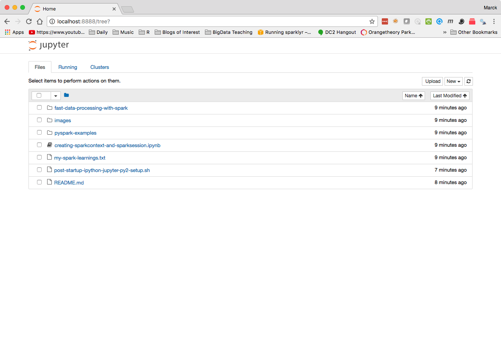

# DNSC 6920 - Big Data - Summer 2017 <br/> Prof. Marck Vaisman <br/> Assignment/Lab/Tutorial # 2 <br/> Due Sunday, July 9

The purpose of this assignment is for you to become familiar with Spark and use Python as a means to work with Spark. This is more of a Lab than an assignment, since you will have a chance to explore multiple Jupyter notebooks with different kinds of data, and functions related to RDDs in Spark.


**Since this assignment was released much later than originally anticipated, the due date has been postponed to Sunday, July 9and is flexible. There will be no deductions for late submittals.**


## Skills you will develop in this assignment

* Using Pyspark and Jupyter notebooks as a means to interface with Spark
* Create an RDD and apply some functions
* Use RDD methods
* Use SparkSQL

## Start your cluster
Create an EMR cluster with *Advanced Options* and the following configuration:

* emr-5.5.0
* Hadoop 2.7.3
* Spark 2.1.0
* Hive 2.1.1
* Make sure you un-check anything else
* Master Nodes: m3.xlarge  count: 1
* Core Nodes: m3.xlarge  count: 3
* Options: No Logging, No Debugging, No Termination Protection
* No bootstrap actions - additional customization will happen after the cluster starts

Once the cluster is in "Waiting" mode (should only take a few minutes), please `ssh` into the master using agent forwarding and port forwarding:

```
ssh-add
ssh -A hadoop@...

```
After you log-in to the master node, run the following commands in your terminal (make sure you change [[your-github-name]] to your repository name in the code below.

```
sudo yum install -y git
git clone git@github.com:gwu-bigdata/summer2017-hw2-[[your-github-name]].git
cd summer2017-hw2-[[your-github-name]]
bash post-startup-ipython-jupyter-py2-setup.sh 
```

These commands will install git, clone your repository to the cluster and run a script that installs iPython and other Python libraries including pandas, Jupyter and starts a notebook web server. This will take a few minutes (it took about 6 minutes in testing, but your time may vary.) When the script is done you will see something like this:

```
ipython and Jupyter (running Python 2) are configured.
To access Jupyter notebook, logoff with the exit command
and log back on using agent and port forwarding:
ssh -A -L8888:localhost:8888 hadoop@...
and then open a web browser and go to http://localhost:8888
```
Once this is done, please type `exit` to logoff and then log back on, making sure you enable both ssh-agent forwarding and port forwarding:


 ```
 ssh-add
 ssh -A -L8888:localhost:8888 hadoop@...
 ``` 
since some environment variables changed. You can then open a browser and navigate to http://localhost:8888 to see your Jupyter Notebook environment. Since you changed directories before running the script, you will see the contents of the repository you just cloned:



## Connecting your Jupyter Notebook to your Spark Cluster

For the sake of speed and simplicity, we will be using just plain Python 2 Jupyter notebooks. Pyspark is not configured to work with Jupyter Notebooks in this installation. Therefore, we need to create the connection object manually for each of our notebooks. 

Open the `creating-sparkcontext-and-sparksession.ipynb` notebook by clicking on it.

You will see the first cell contains the following code:

```{python}
from pyspark import SparkContext, SparkConf
from pyspark.sql import SparkSession
spark = SparkSession.builder.appName("my-app-name").getOrCreate()
sc    = spark.sparkContext      # get the context
```
Running this cell will create the `SparkContext` and `SparkSession` objects inside your notebook. Please read this notebook to familiarize yourself with `SparkContext` and `SparkSession`


## Other Ways to Connect to Spark

There are several other ways to work with spark. We did not talk about them in class and they are here for reference.

### Spark shell (using Scala)

We didn't discuss this much in class. One of the ways to have an interactive session with Spark is by using the spark-shell. This starts an interactive, text based environment where you interact with the cluster using Scala.

Try it out! Type `spark-shell` in the command line. You'll know its Scala because you will see a Scala prompt. You can exit the spark-shell by using the `Ctrl-D` key combination.

```
[hadoop@ip-172-31-62-160 ~]$ spark-shell
Setting default log level to "WARN".
To adjust logging level use sc.setLogLevel(newLevel). For SparkR, use setLogLevel(newLevel).
17/06/27 21:18:02 WARN Utils: Service 'SparkUI' could not bind on port 4040. Attempting port 4041.
17/06/27 21:18:03 WARN Client: Neither spark.yarn.jars nor spark.yarn.archive is set, falling back to uploading libraries under SPARK_HOME.
Spark context Web UI available at http://172.31.62.160:4041
Spark context available as 'sc' (master = yarn, app id = application_1498593832174_0002).
Spark session available as 'spark'.
Welcome to
      ____              __
     / __/__  ___ _____/ /__
    _\ \/ _ \/ _ `/ __/  '_/
   /___/ .__/\_,_/_/ /_/\_\   version 2.1.0
      /_/

Using Scala version 2.11.8 (OpenJDK 64-Bit Server VM, Java 1.8.0_121)
Type in expressions to have them evaluated.
Type :help for more information.

scala>
```

### PySpark shell (regular Python shell)

You can connect to Spark using PySpark, which runs a copy of the Python interpreter that's connected to the Spark runtime. As you can see, you see the Python version. You can exit this shell by typing quit(). If you had not run the scripts you ran after you started the cluster, this is what you would have to use Python with PySpark and Spark. 

```
[hadoop@ip-172-31-62-160 ~]$ pyspark
Python 2.7.12 (default, Sep  1 2016, 22:14:00)
[GCC 4.8.3 20140911 (Red Hat 4.8.3-9)] on linux2
Type "help", "copyright", "credits" or "license" for more information.
Setting default log level to "WARN".
To adjust logging level use sc.setLogLevel(newLevel). For SparkR, use setLogLevel(newLevel).
17/06/27 21:26:05 WARN Utils: Service 'SparkUI' could not bind on port 4040. Attempting port 4041.
17/06/27 21:26:08 WARN Client: Neither spark.yarn.jars nor spark.yarn.archive is set, falling back to uploading libraries under SPARK_HOME.
Welcome to
      ____              __
     / __/__  ___ _____/ /__
    _\ \/ _ \/ _ `/ __/  '_/
   /__ / .__/\_,_/_/ /_/\_\   version 2.1.0
      /_/

Using Python version 2.7.12 (default, Sep  1 2016 22:14:00)
SparkSession available as 'spark'.
>>>
```

### PySpark shell (using iPython - Text Based)

Another way to use PySpark is by telling PySpark to use the iPython shell. Since we installed iPython on this cluster (not installed by default), you need to setup an environment variable before starting PySpark and you will see the difference:

```
[hadoop@ip-172-31-62-160 ~]$ PYSPARK_DRIVER_PYTHON=ipython pyspark
Python 2.7.12 (default, Sep  1 2016, 22:14:00)
Type "copyright", "credits" or "license" for more information.

IPython 5.4.0 -- An enhanced Interactive Python.
?         -> Introduction and overview of IPython's features.
%quickref -> Quick reference.
help      -> Python's own help system.
object?   -> Details about 'object', use 'object??' for extra details.
Setting default log level to "WARN".
To adjust logging level use sc.setLogLevel(newLevel). For SparkR, use setLogLevel(newLevel).
17/06/27 21:42:29 WARN Utils: Service 'SparkUI' could not bind on port 4040. Attempting port 4041.
17/06/27 21:42:31 WARN Client: Neither spark.yarn.jars nor spark.yarn.archive is set, falling back to uploading libraries under SPARK_HOME.
Welcome to
      ____              __
     / __/__  ___ _____/ /__
    _\ \/ _ \/ _ `/ __/  '_/
   /__ / .__/\_,_/_/ /_/\_\   version 2.1.0
      /_/

Using Python version 2.7.12 (default, Sep  1 2016 22:14:00)
SparkSession available as 'spark'.

In [1]:
```

## Explore Tutorials

There are two directories in the GitHub repository:

* `pyspark-examples`: 10 Jupyter Notebooks that were taken from [this repository](https://github.com/jadianes/spark-py-notebooks) and adapted to work on a cluster environment. These tutorials cover different areas of working with RDDs in Spark.

* `fast-data-processing-with-spark`: another 10 Jupyter Notebooks that were adapted from [this book]() and [this repository](https://github.com/xsankar/fdps-v3). There is a 3rd edition out of the book which addresses Spark 2, but the code is still Spark 1.6 so there are some incompatibilities.

The "connection" cell has been added to **most** of them so you can start the notebook and create a connection object. Remember, each notebook requires its own connection object. **Remember to stop the connection before you close the Notebook by using `sc.stop()`.**

For the most part, they work. There are a few errors that were not fixed.

Please spend some time exploring these notebooks so you can have a hands-on learning experience with Spark on a cluster. The files are relatively small and the cluster options are not optimized, but hopefully working through these notebooks will be helpful. 

There is an empty file called `my-spark-learnings.txt` in your repository. Please open this file in your terminal using terminal based editors `nano` [(more on nano here)](https://www.nano-editor.org/)  or `vim` [(more on vim here)](http://www.vim.org/) and write a few words about your experience using Spark after you go through the tutorials. Please commit this file and push to GitHub.


